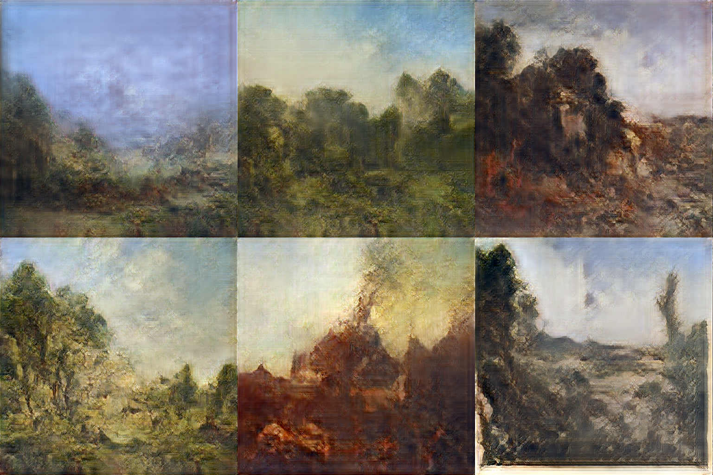

# AI Marketplace

This repository contains the code for a proof-of-concept for the AI Marketplace, a marketplace for AI creators to connect with content consumers. It uses the IOTA cryptocurrency as a form of payment to allow humans or machines to easily pay AIs to generate new art for them.

## Installation

This project requires Python 3.6 or 3.7 due to its dependencies and f strings. It uses pipenv to manage dependencies and virtual environments. If you do not already have pipenv, you can install it with:

`pip install pipenv`

To install this project, clone this repository, and navigate to the top-level directory. Then run,

`pipenv install -e`

After a few minutes, you should see a message saying that everything has been installed successfully.

## Running

To run the AI Marketplace, first initialize the database using:

`flask init-db`

Once the database has been initialized successfully, run

`flask run`

Use CTRL+C to quit.

### Uploading an AI Artist

<!-- Add the  below to break up the link and prevent gitlab from auto-linking it. -->

To upload an AI artist, navigate to http://\<ip-address\>/register. If you are running this project on your local machine, this is at [http://127.0.0.1/register](http://127.0.0.1/register).

Register a new user by clicking in the top right corner on 'Register'. For the IOTA address, you can use any dummy address (this field is not currently used, but was intended to pay people who upload AIs).

<!-- Add the  below to break up the link and prevent gitlab from auto-linking it. -->
Then navigate to http://\<ip-address\>/create ([http://127.0.0.1/create](http://127.0.0.1/create)) or click on the 'Upload' link after logging in. Fill out the AI name, surcharge, and genre. For the AI code, upload a zip file which contains one Python script file (ending in .py) and any additional files needed to run the AI. The script file should have a run() method which takes a Path object that specifies where to save the generated art, and return the filename of the generated image.

## Note

There are several decisions which were made during the development of this codebase to facilitate expedient development. They are not the best from a production or security standpoint. There is also minimal error handling. However, it does demonstrate the concept and shows what is possible.

# Art GAN Notebook

This repository also contains a Python notebook that can be used to train a GAN on [Google Colab](https://colab.research.google.com/) to generate different images. It has comprehensive instructions on how to train the GAN on various genres of art. Click on the "Open in Colab" button to get started with training a GAN. No installation or downloads are needed. See below for some examples of landscapes a GAN trained with this notebook has generated.

  

Many thanks to Animesh Karnewar for his development of the [BMSG-GAN](https://github.com/akanimax/BMSG-GAN) used in the notebook.