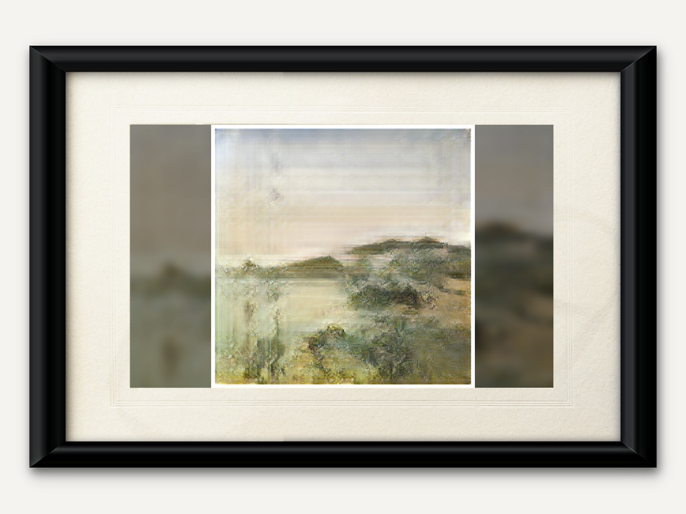

# IOTA Canvas

  

IOTA Canvas is a smart picture frame which periodically changes the art it displays by working with [AI Marketplace](https://gitlab.com/iota-lab/ai-marketplace) to commission an AI-generated piece of art. Each piece of art displayed is therefore unique and has not been viewed by a anyone before. AI Marketplace is compensated by IOTA Canvas with IOTA, a cryptocurrency built for IoT.

## Installation

IOTA Canvas is intended to run on a Raspberry Pi connected to an HD monitor to provide a smart picture frame. However, it should run on any operating system that supports Python (not tested). If you would like to run it on a system other than Raspberry Pi, see the [Development](#development) section for additional steps after installing.

This project requires Python 3.6 or 3.7 due to its dependencies and use of f strings. It uses pipenv to manage dependencies and virtual environments. If you do not already have pipenv, you can install it with:

`$ pip install pipenv`

To install this project, clone this repository, and navigate to the top-level directory. Then run,

`$ pipenv install -e`

After a few minutes, you should see a message saying that everything has been installed successfully.

## Running

To run the software, issue the following command in the iota-canvas directory:

`$ pipenv run python iotacanvas/main.py`

The IOTA Canvas loading page will be shown, and then an address to the settings website will be displayed. Go to the settings website to configure IOTA Canvas, including funding the device's wallet with IOTA.

Use the Devnet faucet to obtain some IOTA tokens to test with. Go to [https://faucet.devnet.iota.org](https://faucet.devnet.iota.org) and enter the IOTA address displayed on the settings page.

To fully test IOTA Canvas, also run the [AI Marketplace](https://gitlab.com/iota-lab/ai-marketplace) and upload an AI which generates art. Instructions are given for this on the AI Marketplace README.

To exit the program, press escape.

## Development

If you would like to test or develop this project on a machine that is not a Raspberry Pi, you will need to use a mock pin factory for the buttons. Set the environment variable GPIOZERO_PIN_FACTORY to 'mock'. This can be done on Linux and Mac using:

`export GPIOZERO_PIN_FACTORY=mock`

and on Windows using:

`set GPIOZERO_PIN_FACTORY=mock`

See the [Gpiozero documentation](https://gpiozero.readthedocs.io/en/stable/api_pins.html#mock-pins) for more details on how to use this functionality.